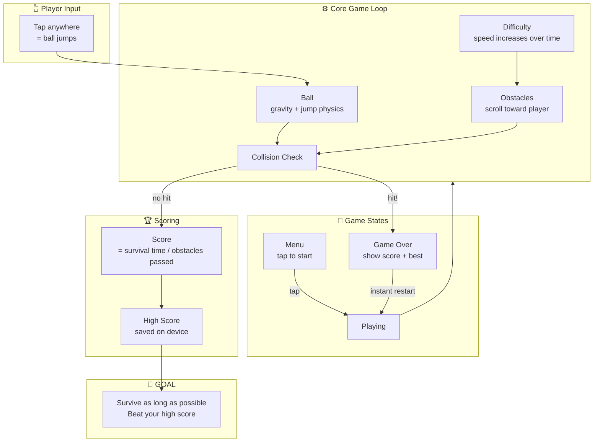

# Tap Bounce — Game Design

A one-tap endless Android game. A ball bounces along an endlessly scrolling
track; the player taps anywhere to make it hop over obstacles. The game gets
faster over time. Dying restarts instantly — the whole loop is built around
"one more try".

**Goal of the game:** survive as long as possible and beat your own high score.

## Core Structure

## What each part means

| Part | Responsibility |
|---|---|
| **Player Input** | Single tap, anywhere on screen. No buttons, no tutorial needed. |
| **Ball** | The player character. Constant forward motion (visually), gravity pulls it down, tap makes it hop. |
| **Obstacles** | Spawn off-screen and scroll toward the ball. Gaps must always be passable. |
| **Difficulty** | Scroll speed (and obstacle density) slowly ramps up — this is what makes it addictive. |
| **Collision Check** | Ball touches obstacle or floor-out → game over. Ball passes obstacle → score +1. |
| **Score / High Score** | Score counts during play; best score persists on the device (no account needed). |
| **Game States** | Menu → Playing → Game Over → instantly back to Playing. Restart must take < 1 second. |

## Design rules (why it's fun & addictive)

- **Zero learning curve:** one input, understood in the first second.
- **Fast failure, faster restart:** death is never frustrating because retry is instant.
- **Rising tension:** speed ramp means every run ends — the score is always beatable.
- **Runs anywhere:** simple 2D shapes, no heavy assets, works on any low-end phone.
